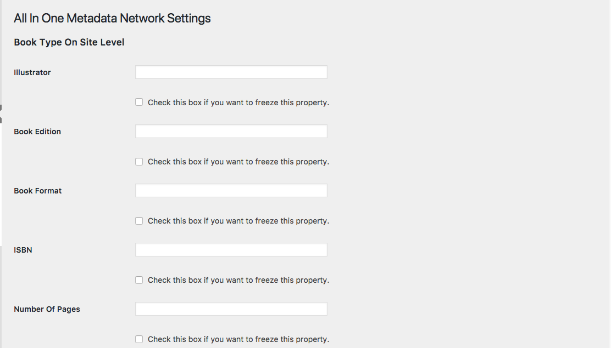
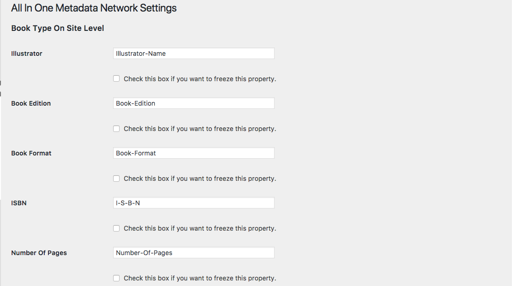

### All In One Metadata Network Settings (Multisite - PressBooks)

In Multisite installations there is a new page in network settings for the creation of network metadata.

>This page is very long as it's still under development. Changes will occur in a later release because the navigation of this page is not efficient as it has a long scrolling and as not all of the schema.org properties are displayed.

The page offer all the available Types with the Properties created from schema.org.

Values can be write in the empty fields and be used in all the sub-sites. Administrators of sub-sites can overwrite the data of the field. But if after the modification of the field by an administrator of a sub-site, the SuperAdmin save again the page, the sub-sites would loose the modifications.

If we want allow the Administrators of the sites to modify the values, after save the value of the field, we have to delete the value of the field and to save again.

If we need to use the same value for a Property in all the sites of the installation, we can freeze the information for one field, and all the Homepages of all the sites of the installation, will use the selected Property. Administrators of sub-sites can not change such value.

By activating a Property, several changes would aplly in different places:

*	Site-Meta Level is activated - (‘Location Of Metadata’ metabox in plugin settings)
*	The Book Type is activated for the Site-Meta level (‘Active Locations For Schema Types’ metabox in plugin settings)
*	The filed in property named ‘Book Format’ is activated for the Book Type Under the Site-Meta Level (‘Edit Type Properties’ link under the Book Type in plugins settings)
*	The filled in property value distributes its self on the property field for each site.

We can not create in site level more information, but we can transfer to the post level the information ........

- As SuperAdmin you area allow to transfer properties from the SuperAdmin settings page to all of the Sites (site meta/book info).

- As Admin, you can later to clone that properties from your site meta to your post or chapter (not any other type of CPT).

---
[Readme](https://github.com/Books4Languages/pressbooks-metadata/blob/master/README.md)
