#abc-xyz

## Installation and Upgrades

* Clone (or copy) this repository to the /wp-content/plugins/ directory
* Activate the plugin through the 'Plugins' screen in WordPress

For upgrades, download the las stable version from github, delete from FTP the old plugin and install the new one.

## Installing Required Plugins

If we were to try to create our plugin without the use of existing plugin solutions we simply would not exist. There is no sustainable way to develop all the functionality needed for our plugin while still being able to offer a competitive price.

* [Custom Metadata Manager](https://github.com/Automattic/custom-metadata) An easy way to add custom fields to your object types (post, pages, custom post types, users) & to generate option pages. PressBooks users have Custom Metadata Manager integrated in the code.

For non PressBooks users, All In One Metadata plugin will let you know with an error that the additional plugin is required and it will provide you with a link so you can download and install it. By clicking the link in the error box you will be provided with the required plugin, upload the plugin to your Wordpress installation using one of the two ways described above when we were installing All In One Metadata, activate the plugin and the error will go away. Now we can start using our newly installed plugin.

## Integrations

All in one metadata works out of the box with:

* [PressBooks](http://github.com/pressbooks/pressbooks/) is a book content management system which exports in multiple formats: ebooks, webbooks, print-ready PDF, and various XML flavours. Pressbooks is built on top of WordPress Multisite.

We are focus with the metadata, all the other SEO solutions can be find trough other plugins:

* [The SEO Framework](https://wordpress.org/plugins/autodescription/)
* [All in one SEO](https://wordpress.org/plugins/all-in-one-seo-pack/)
* [Yoast SEO](https://wordpress.org/plugins/wordpress-seo/)

Not all the plugins are 100% integrated with All in one metadata, some of them works in the site for an enhancement of the features of the site. From the settings page, you can choose to deactivate some of the JSON-LD schema metadata for some integrated plugins.

* Comming soon

## Integrated Theme

Any theme can work with All in one metadata.

## This plugin supports:

* PHP 5.3 and higher.
* WordPress 4.8 and higher.
* Internationalization through WordPress.org.
* MultiSite.
* Translation plugins WPML, Polylang and qTranslate X.
* Custom Post Types.

## Setup the plugin
By activating the plugin, a warming appear in the administrator page with the message:
  Please make sure that the custom-metadata plugin is installed for the full PB Metadata Functionality -- Get it Here

All in one metadata use Custom Metadata Manager (no for PressBooks users) as an easy way to add custom fields to your object types (post, pages, custom post types, users)

All in one metadata will create two new tabs. All In One Metadata settings in Settings and Site metadata in Tools (For PressBooks users, Site metadata is integrated with Book Info).

All in one metadata metadata is put into Object cache when a caching plugin is available. The descriptions and Schema.org scripts are put into Transients. Please be sure to clear your cache.

### All In One Metadata settings
The settings page slplit the settings in
* Location of Metadata
* Activated locations for schema Types
* Specific metadata

#### Location of metadata
Location of metadata allow the configuration of the metadata for Post level, Site level and Multisite level.

* Post level will load all the WordPress posts (Page and Post) and all the Custom Post Types (in a PressBooks installation just the Part, Chapter, Frond Page and Back page CPTs)
* Site level allows to load the metadata for the front page.
* Multisite (comming soon)

After activate the metadata trough the checkbox in the different tabs (Post Level, Site Level or Multisite) in the ‘Location Of Metadata’ and saving, the metabox named ‘Activated Locations For Schema Types’ will display the active places for the metadata.

For Post level

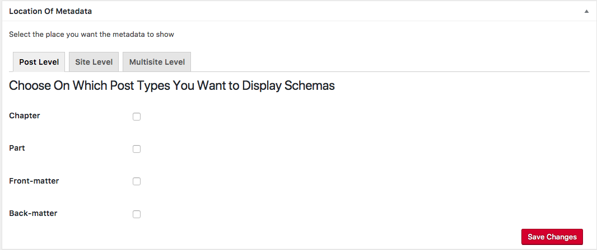

For Site level

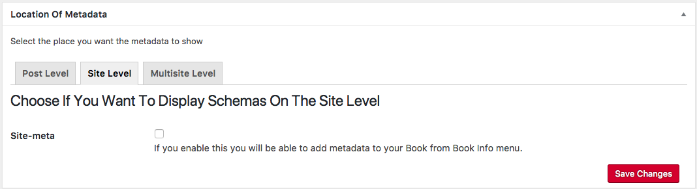

Multisite (comming soon)

#### Activated locations for schema Types
The second metabox in the settings page displays all the active locations that schema metadata will go in, if did not enable any post-type from the above metabox you will see this

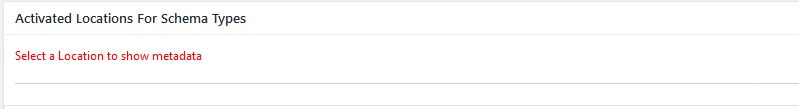

For each one of the activated locations, the different Types and Properties can be activated.

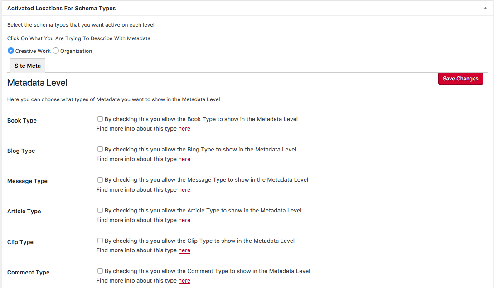

By activating a Type and the properties, the activated properties are show in the location (in Posts or in Site Metadata or Book Info).

The full list of Types and Properties can be find [here](http://schema.org/docs/full.html).

By selecting the first checkbox and saving, the page will refresh and you will see this under all activated types a new option **Edit Type Properties** where the different Properties of the Type can be selected.

##### Edit Type Properties

Edit Type Properties open a new window with all the Properties for a selected Type. The window will be different for the Post level and Site level.

###### Edit Type Properties for Post level

For Post level we can see a checkbox for each Property of the Type

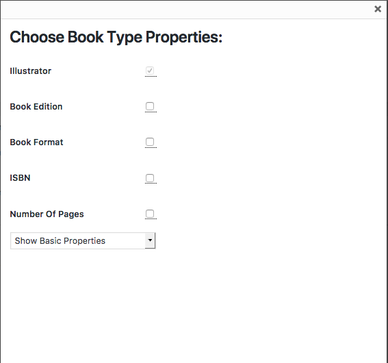

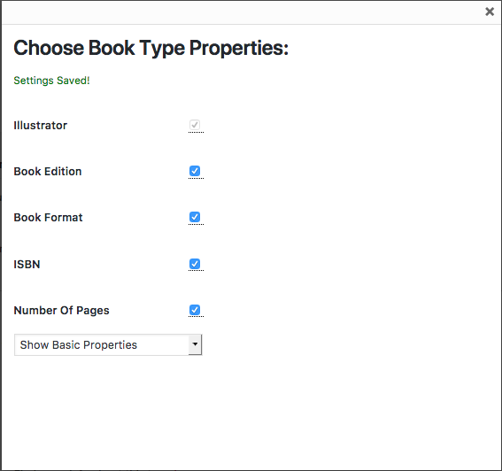

###### Edit Type Properties for Site level

For Site level we have two columns with chekboxes.

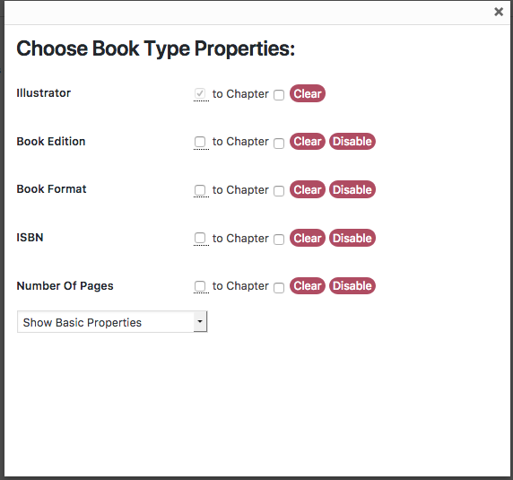

By activating the clone of the information from the Site level to all the posts, the Home page metadata of the selected properties will be clone to all the Post. Also the Clear and Disable buttom will desappear.

The new checkboxes copy the information for a specific property from the Site level to all the Post. By uncheck, the value will remain in the field, but it would be editable by the Site Administrator.

An example of the metabox with the Properties frozzen are [here](https://github.com/Books4Languages/pressbooks-metadata/blob/master/docs/documentation-2.md#frozzen-post-metadata-post-page-or-cpt).

###### Edit Type Properties extended

The drop down menu on the bottom shows alternative properties (organised in 3 groups) for the type that you selected.

* Show basic properties (The specifical properties of the Type).
* Show General Properties (The general properties of all the Types)
* Show Creative Work Properties (The properties of the group of types of the current Type)

When the mouse cursor is over the meta box it's display the description for each property so you don’t have to go to the schema website all the times, once you select or deselect an item from the list the data is saving automatically, some properties will be enabled by default for some types, it means that these properties are mandatory from the schema.org and it’s always good to fill them when creating the post.

 NOTE: that if you activate a Type and you don’t select any properties the metabox will not show in your posts because you simply did not choose anything to describe, if the Type though has required properties by activating it the required properties will show in the metabox.

###### Site Edit Type Properties extended

In Site level, two new bottoms allow new functionalities.

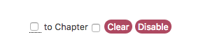

**Clear:** allow to clear all the fiels for a specific Property. Useful if we did clone to all the posts and later we do not whant to show any more such data and we whant to have an empty field.

**Disable:**  allo to disable the selected property from the post level. Note that this will just disable the property NOT the schema type or the active post level.

#### Specific metadata

Offer other types of specific Metadata vocabularies
* Coins
* Dublin Core
* Educational (LRMI)

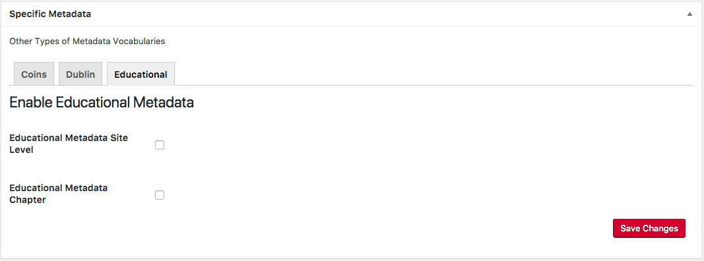

##### Coins

Is a method to embed bibliographic metadata on the homepage by going to its tab checking the checkbox and clicking Save Changes. As before, all metadata related to our homepage can be edited under the Tools tab by selecting Site Metadata (or Book info for PressBooks users).

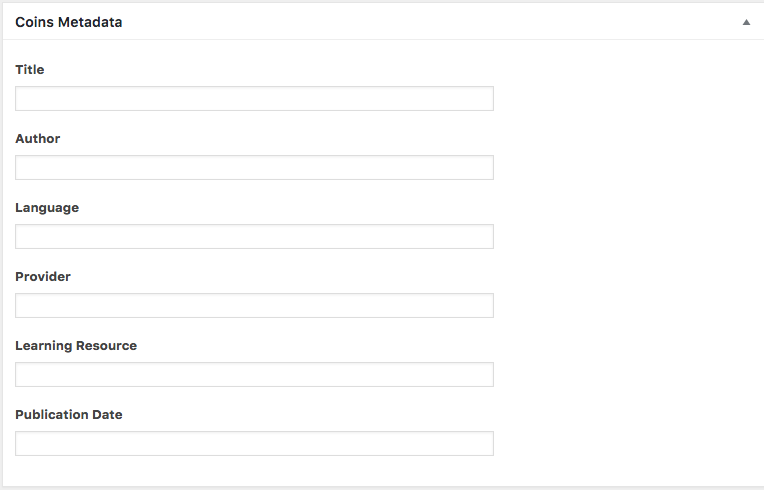

##### Dublin Core

Is a small set of vocabulary terms that can be used to describe web resources on the homepage by going to its tab checking the checkbox and clicking Save Changes. As before, all metadata related to our homepage can be edited under the Tools tab by selecting Site Metadata (or Book info for PressBooks users).
The original set of 15 classic metadata terms, known as the Dublin Core Metadata Element Set.

    Title
    Creator
    Subject
    Description
    Publisher
    Contributor
    Date
    Type
    Format
    Identifier
    Source
    Language
    Relation
    Coverage
    Rights

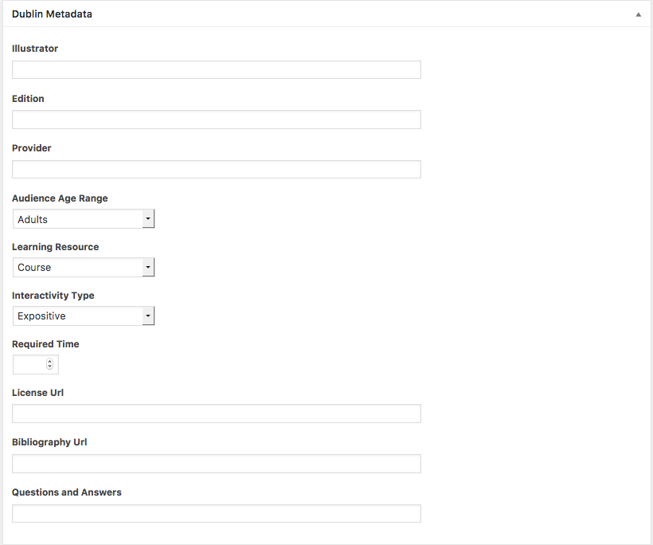

###### Dublin Core Metadata Terms

The Dublin Core Metadata Initiative (DCMI) Metadata Terms is the current set of the Dublin Core vocabulary.[13] This set includes the fifteen terms of the Dublin Core Metadata Element Set (in italic), as well as the qualified terms. Each term has a unique URI in the namespace http://purl.org/dc/terms, and all are defined as RDF properties.

    abstract
    accessRights
    accrualMethod
    accrualPeriodicity
    accrualPolicy
    alternative
    audience
    available
    bibliographicCitation
    conformsTo
    *contributor*
    *coverage*
    created
    *creator*
    *date*
    dateAccepted
    dateCopyrighted
    dateSubmitted
    *description*
    educationLevel
    extent
    *format*
    hasFormat
    hasPart
    hasVersion
    *identifier*
    instructionalMethod
    isFormatOf
    isPartOf
    isReferencedBy
    isReplacedBy
    isRequiredBy
    issued
    isVersionOf
    *language*
    license
    mediator
    medium
    modified
    provenance
    *publisher*
    references
    *relation*
    replaces
    requires
    *rights*
    rightsHolder
    *source*
    spatial
    *subject*
    tableOfContents
    temporal
    *title*
    *type*
    valid

##### Educational Metadata (LRMI)

The [LRMI specification](http://dublincore.org/dcx/lrmi-terms/1.1) is a collection of classes and properties for markup and description of educational resources. The specification builds on the extensive vocabulary provided by Schema.org and other standards. [LRMI terms](http://dublincore.org/dcx/lrmi-terms/) not included in schema.org may nevertheless be used to augment and enrich Schema.org markup.

Index of Terms in the /lrmi-terms/ Namespace
  Classes
  AlignmentObject
  EducationalAudience
  Properties
  alignmentType
  educationalAlignment
  educationalFramework
  educationalRole
  educationalUse
  interactivityType
  isBasedOnUrl
  learningResourceType
  targetDescription
  targetName
  targetUrl
  timeRequired
  typicalAgeRange
  useRightsUrl

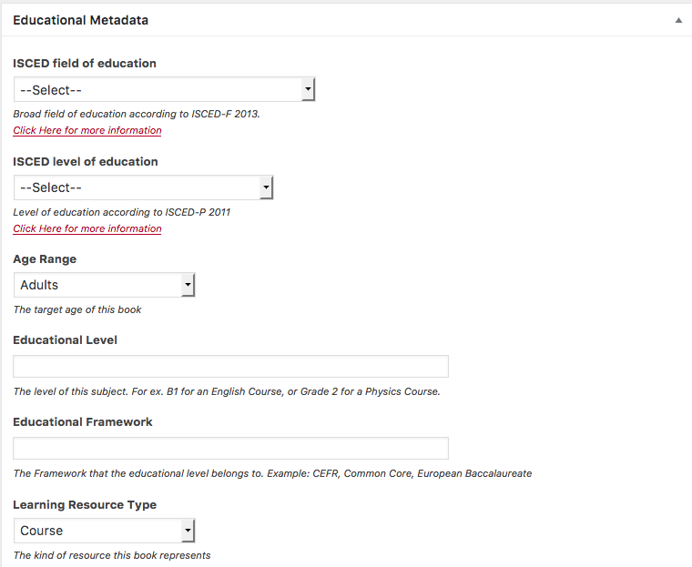

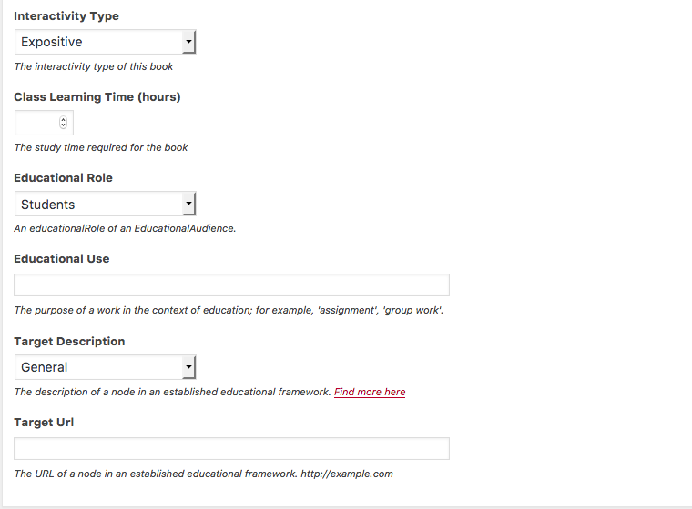

### Post metadata (Post, Page or CPT)

In your selected Post, Page or a Custom Post Type will appear a new metabox for the creation of the metadata. Simply add the info in the fields from the new metabox to describe the selected properties.

Once the information is created-updated, click Save Changes.

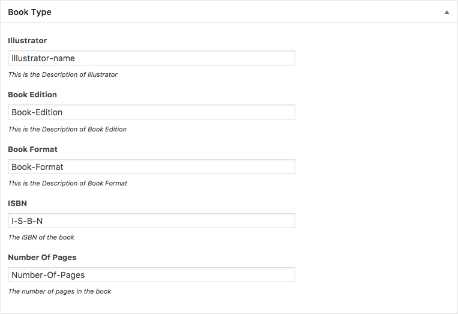

#### Frozzen Post metadata (Post, Page or CPT)

If the Properties are frozzen from the Site level, instead of cells for writing the information, we will see for each frozzen property the values from the same property in written in Site level.

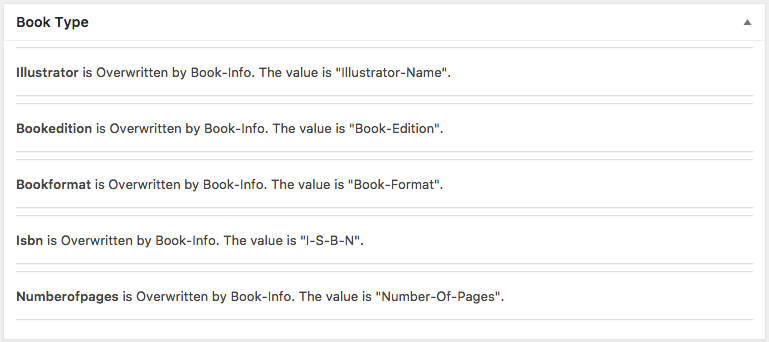

google will be able to read the metadata in the post (Test with [Google structured data testing tool](https://search.google.com/structured-data/testing-tool/u/0/)).

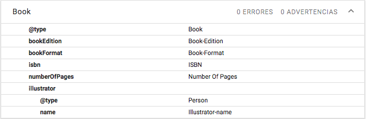

### Site metadata (Book Info for PressBooks)

Site metadata allow to create the metadata for the main page. Also is the place where the metadata must be site available can be writing for all the posts, pages or CPTs.

Each Type is a section with all the Properties of the Type and the supersedes Type.

Now, simply add the info in the fields from the new metabox to describe the selected properties

Once the information is created-updated, click Save Changes.

google will be able to read the metadata in the Main Page (Test with [Google structured data testing tool](https://search.google.com/structured-data/testing-tool/u/0/)).

  #### Location of metadata
  Location of metadata allow the configuration of the metadata for Post level, Site level and Multisite level.

  * Post level will load all the WordPress posts (Page and Post) and all the Custom Post Types (in a PressBooks installation just the Part, Chapter, Frond Page and Back page CPTs)
  * Site level allows to load the metadata for the front page.
  * Multisite (coming soon)

### All In One Metadata Network Settings (Multisite - PressBooks)

- As SuperAdmin you area allow to transfer properties from the SuperAdmin settings page to all of the Sites (site meta/book info).

- As Admin, you can later to clone that properties from your site meta to your post or chapter (not any other type of CPT).

---
[Readme](https://github.com/Books4Languages/pressbooks-metadata/blob/master/README.md)
