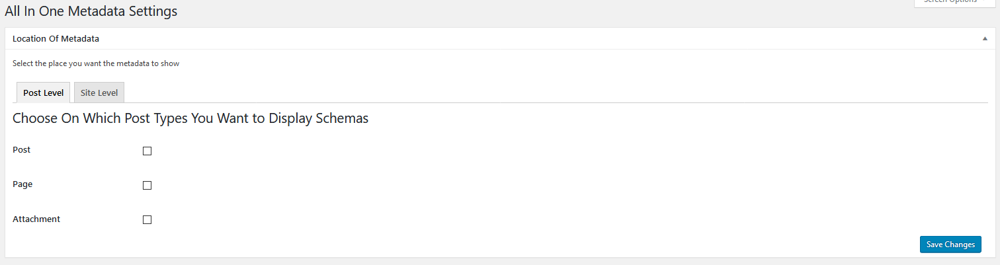
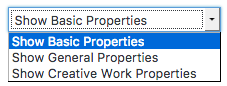

#abc-xyz

## Installation and Upgrades

* Clone (or copy) this repository to the /wp-content/plugins/ directory
* Activate the plugin through the 'Plugins' screen in WordPress

For upgrades, download the las stable version from github, delete from FTP the old plugin and install the new one.

## Installing Required Plugins

If we were to try to create our plugin without the use of existing plugin solutions we simply would not exist. There is no sustainable way to develop all the functionality needed for our plugin while still being able to offer a competitive price.

* [Custom Metadata Manager](https://github.com/Automattic/custom-metadata) An easy way to add custom fields to your object types (post, pages, custom post types, users) & to generate option pages. PressBooks users have Custom Metadata Manager integrated in the code.

For non PressBooks users, All In One Metadata plugin will let you know with an error that the additional plugin is required and it will provide you with a link so you can download and install it. By clicking the link in the error box you will be provided with the required plugin, upload the plugin to your Wordpress installation using one of the two ways described above when we were installing All In One Metadata, activate the plugin and the error will go away. Now we can start using our newly installed plugin.

## Integrations

All in one metadata works out of the box with:

* [PressBooks](http://github.com/pressbooks/pressbooks/) is a book content management system which exports in multiple formats: ebooks, webbooks, print-ready PDF, and various XML flavours. Pressbooks is built on top of WordPress Multisite.

We are focus with the metadata, all the other SEO solutions can be find trough other plugins:

* [The SEO Framework](https://wordpress.org/plugins/autodescription/)
* [All in one SEO](https://wordpress.org/plugins/all-in-one-seo-pack/)
* [Yoast SEO](https://wordpress.org/plugins/wordpress-seo/)

Not all the plugins are 100% integrated with All in one metadata, some of them works in the site for an enhancement of the features of the site. From the settings page, you can choose to deactivate some of the JSON-LD schema metadata for some integrated plugins.

* Comming soon

## Integrated Theme

Any theme can work with All in one metadata.

## This plugin supports:

* PHP 5.3 and higher.
* WordPress 4.8 and higher.
* Internationalization through WordPress.org.
* MultiSite.
* **Detection of various other popular SEO tools to prevent duplicated output.**
* Translation plugins WPML, Polylang and qTranslate X.
* Custom Post Types.

## Setup the plugin
By activating the plugin, a warming appear in the administrator page with the message:
  Please make sure that the custom-metadata plugin is installed for the full PB Metadata Functionality -- Get it Here

All in one metadata use Custom Metadata Manager (no for PressBooks users) as an easy way to add custom fields to your object types (post, pages, custom post types, users)

All in one metadata will create two new tabs. All In One Metadata settings in Settings and Site metadata in Tools (For PressBooks users, Site metadata is integrated with Book Info).

All in one metadata metadata is put into Object cache when a caching plugin is available. The descriptions and Schema.org scripts are put into Transients. Please be sure to clear your cache.

### All In One Metadata settings
The settings page slplit the settings in
* Location of Metadata
* Activated locations for schema Types
* Specific metadata

#### Location of metadata
Location of metadata allow the configuration of the metadata for Post level, Site level and Multisite level.

* Post level will load all the WordPress posts (Page and Post) and all the Custom Post Types (in a PressBooks installation just the Part, Chapter, Frond Page and Back page CPTs)
* Site level allows to load the metadata for the front page.
* Multisite (comming soon)

After activate the metadata trough the checkbox in the different tabs (Post Level, Site Level or Multisite) in the ‘Location Of Metadata’ and saving, the metabox named ‘Activated Locations For Schema Types’ will display the active places for the metadata.

#### Activated locations for schema Types
The second metabox in the settings page displays all the active locations that schema metadata will go in, if did not enable any post-type from the above metabox you will see this

For each one of the activated locations, the different Types and Properties can be activated.

By activating a Type and the properties, the activated properties are show in the location (in Posts or in Site Metadata or Book Info).

The full list of Types and Properties can be find [here](http://schema.org/docs/full.html).

By selecting the first checkbox and saving, a new option will appear. *Edit Type Properties* where the different Properties of the Type can be selected.

Edit Type Properties allow to see the properties organised in 3 groups.

* Show basic properties (The specifical properties of the Type).
* Show General Properties (The general properties of all the Types)
* Show Creative Work Properties (The properties of the group of types of the current Type)

#### Specific metadata
Offer other types of specific Metadata vocabularies
* Coins
* Dublin Core
* Educational (LRMI)

##### Coins
Is a method to embed bibliographic metadata

##### Dublin Core
Is a small set of vocabulary terms that can be used to describe web resources.
The original set of 15 classic metadata terms, known as the Dublin Core Metadata Element Set.

    Title
    Creator
    Subject
    Description
    Publisher
    Contributor
    Date
    Type
    Format
    Identifier
    Source
    Language
    Relation
    Coverage
    Rights

The Dublin Core Metadata Initiative (DCMI) Metadata Terms is the current set of the Dublin Core vocabulary.[13] This set includes the fifteen terms of the Dublin Core Metadata Element Set (in italic), as well as the qualified terms. Each term has a unique URI in the namespace http://purl.org/dc/terms, and all are defined as RDF properties.

    abstract
    accessRights
    accrualMethod
    accrualPeriodicity
    accrualPolicy
    alternative
    audience
    available
    bibliographicCitation
    conformsTo
    _contributor_
    _coverage_
    created
    _creator_
    _date_
    dateAccepted
    dateCopyrighted
    dateSubmitted
    _description_
    educationLevel
    extent
    _format_
    hasFormat
    hasPart
    hasVersion
    _identifier_
    instructionalMethod
    isFormatOf
    isPartOf
    isReferencedBy
    isReplacedBy
    isRequiredBy
    issued
    isVersionOf
    _language_
    license
    mediator
    medium
    modified
    provenance
    _publisher_
    references
    _relation_
    replaces
    requires
    _rights_
    rightsHolder
    _source_
    spatial
    _subject_
    tableOfContents
    temporal
    _title_
    _type_
    valid

### Site metadata (Book Info for PressBooks)
Site metadata allow to create the metadata for the main page. But is also the place where the metadata must be site available can be writing for all the posts, pages or CPTs.

Each Type is a secction with all the Properties of the Type and the supersedes Type.

### All In One Metadata Network Settings (Multisite - PressBooks)

- As SuperAdmin you area allow to transfer properties from the SuperAdmin settings page to all of the Sites (site meta/book info).

- As Admin, you can later to clone that properties from your site meta to your post or chapter (not any other type of CPT).
