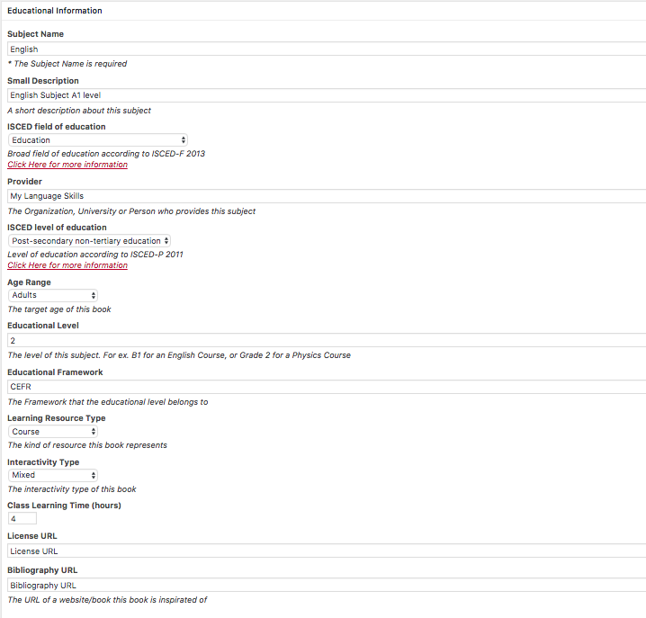
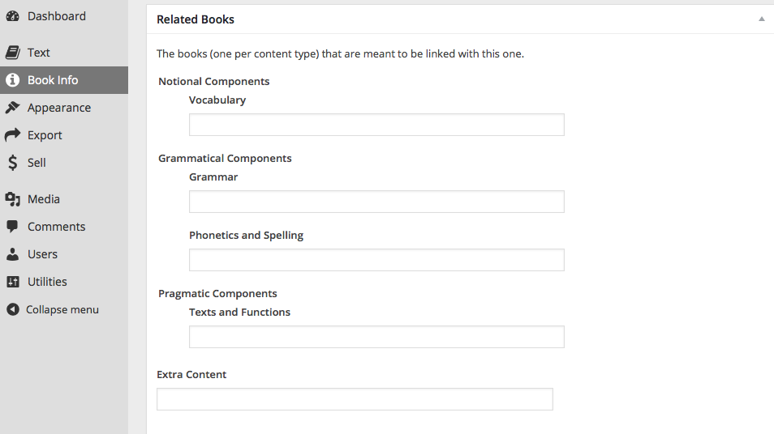
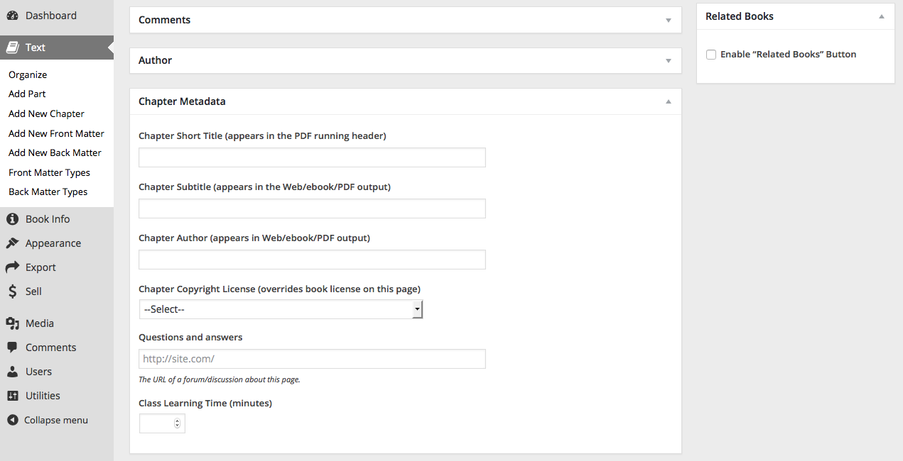
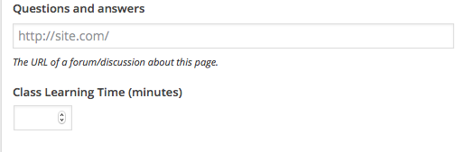
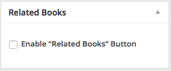

# Pressbooks-Metadata

## Descrtiption
Adds useful navigation and semantic features to PressBooks.

1. Adds Metadata
1. Adds Related Books with an integrated navigation menu
1. Adds Question and Answer forum for each page
1. Adds a search engine plugin for the website version of the book, reducing the need to generate a traditional index.
1. Add a New Template

### 1. Adds Metadata
1. Target Language (the languaget this book is about): European official languages
2. Level (the language level this book is about): CERF
3. Learning Resource Type (the kind of resource this book represent): 
course
examination
exercise
4. Interactivity Type (the interactivity type of this book): active / expositive / mixed
5. Age Range (The target age of this book)

### 2. Adds Related Books with an integrated navigation menu

### 3. Adds Question and Answer forum for each page
Go to  ..... and write the link where the students can ask questions and get answers.

### 4. Adds Search Engine
From PressBooks TextBooks we import the Relevanssi plugin.
    Search results sorted in the order of relevance, not by date.
    Fuzzy matching: match partial words, if complete words don't match.
    Find documents matching either just one search term (OR query) or require all words to appear (AND query).
    Search for phrases with quotes, for example "search phrase".
    Create custom excerpts that show where the hit was made, with the search terms highlighted.
    Highlight search terms in the documents when user clicks through search results.
    Search comments, tags, categories and custom fields.

### 5. Adds New Template

## Requirements

This plugin uses some features from PressBooks, thus you should have installed and activated this plugin (tested on 2.4.2).

##Installation

1. Clone (or copy) this repository to the /wp-content/plugins/ directory
1. Activate the plugin through the 'Plugins' menu in WordPress

## Screenshots

### 1. The added Metadata

### 2 The added of Related Books

###  1-2-3 New options in authors writig page

### 1.1 New Metadata in writing page

### 2.1 Activate Related Books for the page

### 3 Questions and Answer forum page link

## Changelog

### 0.1
* Initial version.

## Credits

Uses the [WordPress Plugin Boilerplate](http://wppb.io).

Uses the [WordPress Plugin PressBooks TexBooks](https://github.com/BCcampus/pressbooks-textbook).

Uses the [WordPress Plugin Relevanssi from PressBooks TexBooks](https://wordpress.org/plugins/relevanssi/).

